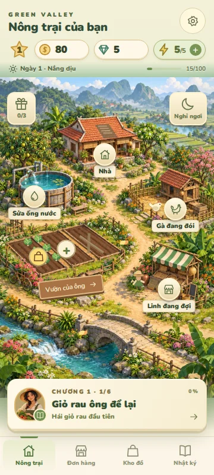
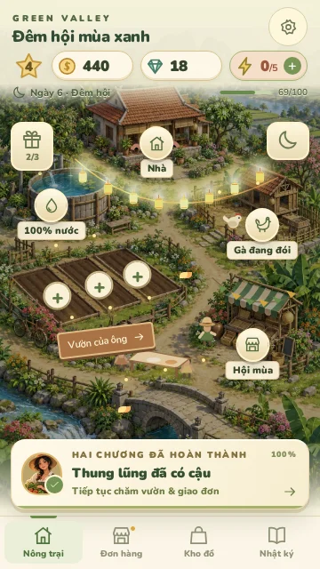
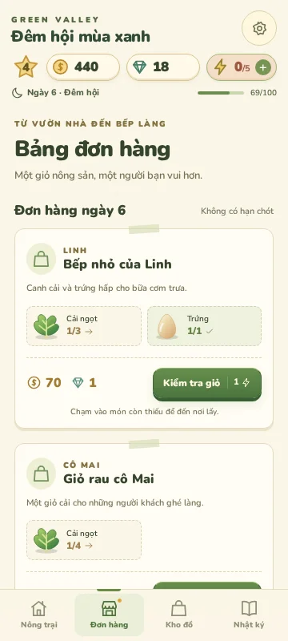

# Kiểm tra bản 0.2

Audit và hướng sửa: [REDESIGN_0.2.md](REDESIGN_0.2.md). Hai chương được kiểm tra qua DOM/controls thật của bản production, không sửa tài nguyên/save để đi tắt.

| Kiểm tra              | Kết quả                                                                                                                                                  |
| --------------------- | -------------------------------------------------------------------------------------------------------------------------------------------------------- |
| npm install           | Pass, package/lockfile 0.2.0; không thêm runtime dependency                                                                                              |
| npm run lint          | Pass                                                                                                                                                     |
| npm test              | 13 bài: Chương 1 và 2, recovery từ tài nguyên 0, timer, thao tác lặp, khóa giống, tưới/tăng sản lượng, migrate v4/v5/v6, quà ngày, đơn/ngày, nâng đàn gà |
| npm run build         | Pass; JS chính khoảng 305 KB trước gzip, không thêm renderer nặng                                                                                        |
| npm run test:ui       | Pass: 13 cột mốc qua giao diện trong 6 ngày game, có thu hoạch trực tiếp trên bản đồ                                                                     |
| Responsive            | 360×640, 375×812, 390×844, 430×932, 768×1024, 1024×768, 1440×900; không tràn ngang                                                                       |
| Vùng chạm bản đồ      | Tâm mỗi nút khu vực/luống không bị HUD, nhiệm vụ hoặc công cụ che; đã sửa bể nước bị nút nghỉ che ở 360×640                                              |
| Navigation            | Bốn tab, năm khu vực, bảng đơn và các món còn thiếu dẫn đúng nơi                                                                                         |
| Lưu/reset             | Reload giữ đoạn kết; hủy reset giữ tiến trình; xác nhận về ngày 1/80 xu/5 energy và phần mở đầu                                                          |
| Migration             | Save v5 giữ energy 4/5 thành 4/5, tiền, upgrade, milestones và timer; tự thêm trường mới                                                                 |
| Accessibility/runtime | Focus giữ trong dialog, Escape, vuốt đóng, reduced motion; không có pageerror/console error                                                              |
| npm run cap:sync      | Pass; App + Haptics plugin                                                                                                                               |
| Android source        | versionCode 2, versionName 0.2.0, giữ app ID com.nguyquan.farmgame                                                                                       |
| Git hygiene           | Không track node_modules, dist, APK, env, keystore, local.properties hoặc build output                                                                   |

Ảnh thực tế từ browser production:

Browser kiểm thử cài riêng ngoài runtime app vì CDN Playwright không tải được trong môi trường local. CI dùng Chromium tiêu chuẩn qua `npx playwright install --with-deps chromium`.

Build APK local vẫn cần JDK 21 / Android SDK 36; môi trường thực hiện không có đủ Android tooling và đường tải Gradle không truy cập được. Workflow Android alpha là nơi build APK; chỉ coi phát hành thành công khi workflow xanh và release `v0.2.0-android-alpha` có asset thực tế.

Chưa chơi trên điện thoại Android thật để xác minh haptic, Back, inset của từng hãng và cảm giác thao tác. Chưa có playtest người mới để xác nhận độ cuốn hút hay mốc 8–15 phút của Chương 1. Kiểm thử tự động xác nhận tính hoàn thành và đúng luật, không thay thế đánh giá người chơi.
