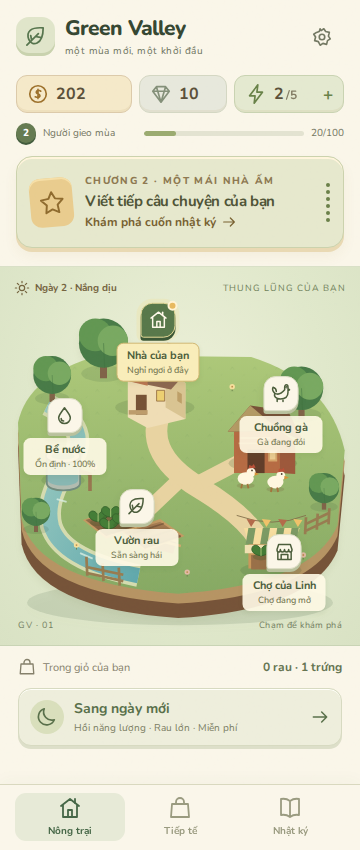
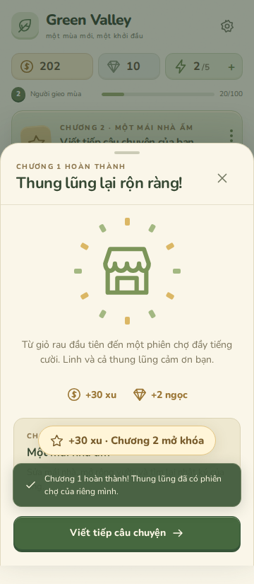

# Kiểm tra bản alpha

Baseline inspect: React 19/Vite 8, CSS thuần, App.jsx chứa state/mission/UI/audio, localStorage v4, ảnh diorama local; renderer Three.js chưa dùng; Capacitor Android cũ có app ID khác. Initial commit chứa node_modules/dist, khiến build Linux bị `vite: Permission denied`. Đã giữ nền React/Vite, artwork và Web Audio, tách game logic khỏi UI và cài dependency sạch.

| Kiểm tra | Kết quả |
| --- | --- |
| npm install | Pass, lockfile được cập nhật |
| npm run lint | Pass |
| npm test | Pass: 9 bài test, gồm Chương 1, upgrade, timer, recovery, duplicate action, migration/reset |
| npm run build | Pass |
| npm run test:ui | Pass: browser Chromium, bản dist production |
| Responsive | 360, 375, 390, 430, 768, 1024, 1440px: document và sheet không tràn ngang |
| Chương 1 UI | Hái → sửa → cho ăn → ngày mới → nhặt trứng → giao Linh → mở chợ |
| Vòng trồng rau UI | Gieo, tưới, sang ngày mới làm rau chín |
| Lưu/reset UI | Reload giữ Chương 2; hủy reset giữ save; xác nhận reset về ngày 1/80 xu/5 năng lượng |
| Navigation/sheet | Tất cả 3 tab và 5 khu vực; Escape, focus trong modal, vuốt đóng sheet |
| Motion/runtime | prefers-reduced-motion hoạt động; không có pageerror |
| npm run cap:sync | Pass, App + Haptics plugin được đăng ký |
| Android source | App ID, Java package, manifest, wrapper và icon/splash tồn tại trong repo |
| Git hygiene | Dependency/build output đã bỏ tracking; .gitignore chặn APK, .env, keystore, local.properties |
| npm run android:debug local | Không pass: Gradle download Network is unreachable; Java 17, chưa có JDK 21/SDK 36 |

Browser kiểm tra chạy trong cùng tiến trình local server để phù hợp network isolation của môi trường. Chromium cho kiểm tra được cài riêng, không nằm trong dependency runtime hay source repo. Máy/CI thông thường dùng `npx playwright install chromium` rồi `npm run test:ui`.

Cần playtest thiết bị Android thật cho haptic, native Back và edge-to-edge. Mục tiêu thời lượng Chương 1 8–15 phút chưa được xác nhận bằng người chơi; sang ngày mới cho phép hoàn thành nhanh hơn. Không có giới hạn chờ hoặc yêu cầu mua hàng.

Trạng thái CI/Release xem workflow Android alpha trên GitHub. Chỉ coi APK đã phát hành khi có workflow thành công và release asset thực tế.
